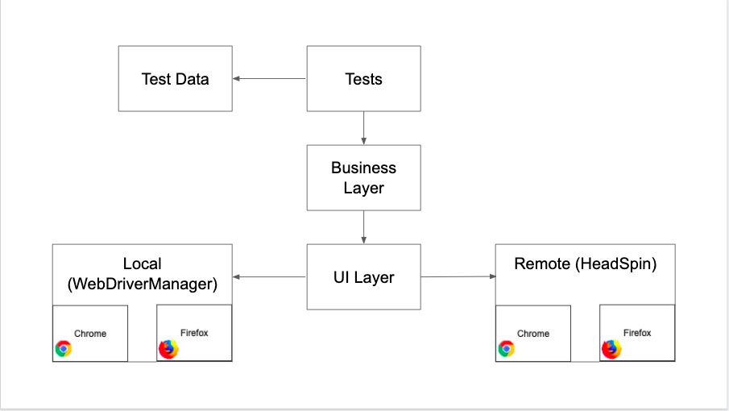

## MMT Automation - HeadSpin Hackathon

Web Automation Testing of one of the flows of Make My Trip site.

### Pre-requisites

- [Java 14](https://jdk.java.net/14/)
- [Maven](https://maven.apache.org/download.cgi)

Note: This project makes use of some preview features of Java 14

### Project Structure
The main directories / files in the project are as below:
- tests: The directory for all tests
- business_layer: An orchestration layer that contains all business logic and assertions
- ui_layer: Directory that contains all pages or components where actual interactions with the elements take place.
It also contains factory classes which return correct instances based on run time information.
- resources: Resources that are required for the tests like test data, testNG.xml, etc.
- helpers: Directory that contains helper classes like DriverHelper, RunHelper, etc.

### Architecture diagram


### User Journey that is Automated
- Visit "Make My Trip" Page
- Search Hotels
- Select Hotel and Room
- Fill in Details
- Proceed to Checkout
- Check Booking Summary 

### Run Test
Tests can be run on locally or on remote HeadSpin browsers. This is achieved by using different `testNG.xml` files and
passing the required file_path as parameter. Please run the test commands from the project directory `hawk_eye_mmt_e2e_test`.  
Note: Tests can be run in parallel.

Run tests locally:
```$xslt
mvn clean test -Dsurefire.suiteXmlFiles=src/test/resources/testng_local.xml
```
Run tests on HeadSpin browsers:
```$xslt
mvn clean test -Dsurefire.suiteXmlFiles=src/test/resources/testng_remote.xml
```   
Video of a remote test run can be found [here](https://drive.google.com/file/d/1ssrhNyDcM--1TD9A3gtIJgocmwrjyng7/view?usp=sharing)

### Reports
Allure reports are generated after tests run:  

